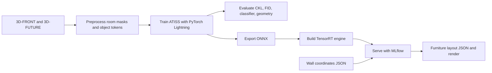

## ATISS: Autoregressive Transformers for Indoor Scene Synthesis

<p>
    
    
    
</p>

## Project Goal: Furniture Layout Generation

### Problem Statement

The goal of this project is to develop a system for automatic furniture layout
generation given the geometry of an indoor room. The model should place
furniture so that the resulting arrangement is consistent with the functional
purpose of the room, satisfies hard geometric constraints such as the positions
of load-bearing walls, and follows ergonomic and aesthetic principles.

In practice, the model automates one of the key stages of interior design:
creating a feasible and visually plausible planning solution for a room.

### Input and Output Format

The input is a list of parameterized walls. Each wall is represented by the
two-dimensional coordinates of its endpoints:

$$
w_j = \left((x_j^{(1)}, y_j^{(1)}), (x_j^{(2)}, y_j^{(2)})\right).
$$

The output is a sequence of furniture objects:

$$
o_i = [\text{class\_id}, x_i, y_i, w_i, l_i, \sin(\theta_i), \cos(\theta_i)].
$$

Here, $\text{class\_id}$ is the furniture category, $(x_i, y_i)$ is the object
center, $w_i$ and $l_i$ are the object's width and length, and $\theta_i$ is
the rotation angle.

### Data Preprocessing and Encoding

The preprocessing pipeline converts raw room annotations into a compact model
representation. For each room, the wall geometry is normalized to a canonical
coordinate system centered around the room, rasterized into a binary room-layout
mask, and stored together with the normalized furniture annotations. This
matches the ATISS conditioning setup, where the transformer receives a spatial
room-layout feature map rather than raw wall coordinates directly.

The wall input is therefore encoded in two complementary forms:

- A structured geometric representation:

  $$
  W = \{w_j\}_{j=1}^{N_w}, \quad
  w_j = (x_j^{(1)}, y_j^{(1)}, x_j^{(2)}, y_j^{(2)}).
  $$

- A rasterized occupancy mask:

  $$
  M \in \{0, 1\}^{H \times W},
  $$

  where pixels inside the room boundary are marked as valid placement area and
  pixels outside the room are masked out.

During training, every furniture object is encoded as a token containing a
categorical component and continuous geometric attributes:

$$
t_i =
\left[
\text{onehot}(\text{class\_id}_i),
x_i, y_i, w_i, l_i, \sin(\theta_i), \cos(\theta_i)
\right].
$$

The continuous attributes are normalized using statistics computed on the
training split. The autoregressive training sequence is augmented with special
start and end tokens, while teacher forcing is used to provide the ground-truth
previous objects at each generation step.

### Postprocessing and Layout Validation

At inference time, the model predicts a sequence of object tokens. These tokens
are decoded back into furniture categories, denormalized coordinates, sizes, and
rotation angles. The final structured output is converted to the target object
format:

$$
o_i = [\text{class\_id}, x_i, y_i, w_i, l_i, \sin(\theta_i), \cos(\theta_i)].
$$

Postprocessing includes removing special tokens, mapping predicted categories to
the furniture taxonomy, reconstructing object-oriented bounding boxes, and, when
3D assets are available, retrieving the closest matching 3D-FUTURE mesh for each
predicted object. The generated layout is then validated with geometric checks:
object-object collisions, objects outside the room boundary, invalid sizes, and
scene-level consistency constraints.

### Evaluation Metrics

Following recent work on furniture layout generation, the project uses the
following metrics:

- **FID** (Fréchet Inception Distance): measures the perceptual similarity
  between generated and real scenes. Lower values indicate better visual
  quality.
- **CKL** (Categorical KL Divergence): measures the discrepancy between the
  furniture category distribution in generated scenes and real training data.
- **Col_obj**: the percentage of objects that collide with other objects in the
  scene. Lower values indicate more physically plausible layouts.
- **R_out**: the fraction of objects that lie outside the room boundary.

### Validation and Testing

The validation strategy follows the original
[ATISS paper](https://arxiv.org/abs/2110.03675) and uses explicit train,
validation, and test splits from the dataset annotation files. The training
split is used to fit model parameters and compute normalization statistics. The
validation split is used for overfit control during training.
The test split is kept for final metric reporting only.

For each evaluated checkpoint, the validation pipeline performs the following
steps:

1. Load room layouts from the validation or test split.
2. Generate one or more furniture layouts conditioned on each room mask.
3. Decode predicted tokens into object categories, positions, sizes, and
   rotations.
4. Render generated layouts into top-down images.
5. Compute distributional metrics against real scenes: CKL, FID, and
   real-vs-synthetic classifier accuracy.
6. Compute geometric validity metrics: object collision rate and out-of-room
   rate.

For reproducibility, the implementation reuses the original
[ATISS repository](https://github.com/nv-tlabs/ATISS) scripts whenever possible.
The expected evaluation artifacts are generated renderings, structured object
predictions, exported 3D scenes, per-metric `.npz` files, and an aggregated
`metrics.json` report.

### Dataset

The project uses dataset:

- [3D-FRONT](https://tianchi.aliyun.com/dataset/65347): a dataset of more than
  40K indoor rooms and layouts, used here under educational access.

A possible issue is annotation noise: some scenes may contain floating objects
or furniture intersecting walls. Such invalid layouts should be removed with a
filtering script before training.

### Modeling Approach

#### Baseline

A promising baseline can be built with the Gemini API: provide an LLM with a structured dictionary of wall coordinates, then ask it to return a furniture layout in the same output format defined above.

#### Main Model

The main model is
[ATISS](https://arxiv.org/abs/2110.03675) (Autoregressive Transformers for
Indoor Scene Synthesis). ATISS is a transformer-based generative model that
represents an indoor scene as an unordered set of objects rather than as a fixed
sequence.

The training pipeline follows the ATISS formulation and is implemented with
PyTorch Lightning. Given the room layout, the model autoregressively generates
the next furniture object and optimizes a classification loss for the object
category together with regression losses for its position, size, and rotation:

$$
\mathcal{L}
= \mathcal{L}_{\text{CE}}(\text{class})
+ \lambda_t \mathcal{L}_{\text{reg}}(x, y)
+ \lambda_s \mathcal{L}_{\text{reg}}(w, l)
+ \lambda_\theta \mathcal{L}_{\text{reg}}(\theta).
$$

Training uses teacher forcing: at each autoregressive step, the model receives
the ground-truth objects from the dataset rather than its own previous
predictions.

### Deployment

The intended deployment format is an inference service with a UI for room
geometry input. The user provides wall coordinates, and the service returns a
generated layout as both a rendered image and a structured list of furniture
objects.

The inference pipeline is:

1. Receive wall coordinates from the UI or API.
2. Validate the polygon geometry and reject self-intersecting or incomplete
   room boundaries.
3. Normalize coordinates and rasterize the room into the layout mask $M$.
4. Load the trained model once at service startup.
5. Run autoregressive generation until the end token is produced or the maximum
   number of objects is reached.
6. Decode and denormalize predicted furniture tokens.
7. Run postprocessing and geometric validation.
8. Return JSON with object parameters and, optionally, a top-down render or 3D
   scene export.

The model will be exported in two deployment formats:

- **ONNX** for portable inference and integration with standard serving
  backends.
- **TensorRT** for optimized NVIDIA GPU inference with lower latency and memory
  usage.

## Setup

This project is packaged as a Python package and uses `uv` for dependency
management.

```bash
uv sync --all-extras --dev
pre-commit install
pre-commit run -a
```

The repository also uses DVC for data and model artifacts. Two local remotes are
configured:

```bash
dvc remote list
dvc pull
dvc pull --remote models
```

The public train, export, server, and inference commands call the project
`download_data()` helper before loading data or checkpoints. The helper pulls
both configured DVC remotes so a clean clone can fetch dataset and model
artifacts without a separate manual step.

If you add or refresh large external artifacts, track them through DVC instead
of git, for example:

```bash
dvc add --external <YOUR_PATH_TO_ATISS_PROCESSED_BEDROOMS>
dvc add --external <YOUR_PATH_TO_3D_FRONT>
dvc add --external <YOUR_PATH_TO_3D_FUTURE_MODEL>
dvc push -r data
dvc push -r models
```

## Train

The public training workflow is split into preprocessing, 3D-FUTURE pickling,
and model training. All commands use Hydra configs from `configs/`.

```bash
uv run furniture-layout preprocess
uv run furniture-layout pickle-future
uv run furniture-layout train
```

Configuration values can be overridden from the CLI:

```bash
uv run furniture-layout train train.experiment_tag=debug_run train.pull_data=false
```

Training uses PyTorch Lightning. Metrics, losses, hyperparameters, and the git
commit id are logged to MLflow at `http://127.0.0.1:8080` by default. Training
plots are saved under `plots/`.

## Infer

The inference input is a JSON room description with wall endpoints:

```json
{
  "room_id": "example_bedroom",
  "walls": [
    { "x1": -2.5, "y1": -2.0, "x2": 2.5, "y2": -2.0 },
    { "x1": 2.5, "y1": -2.0, "x2": 2.5, "y2": 2.0 },
    { "x1": 2.5, "y1": 2.0, "x2": -2.5, "y2": 2.0 },
    { "x1": -2.5, "y1": 2.0, "x2": -2.5, "y2": -2.0 }
  ]
}
```

Run a format validation smoke test:

```bash
uv run furniture-layout infer configs/infer/example_room.json
```

This command resolves dataset, checkpoint, and texture paths from the Hydra
configuration in `configs/` and pulls DVC artifacts before loading the model.

Generate layouts, top-down renders, and optional 3D exports from a trained
checkpoint:

```bash
uv run furniture-layout generate
uv run furniture-layout evaluate
```

The output JSON format contains the room id, generation status, and an `objects`
array. Each object follows the project vector format:

$$
o_i = [\text{class\_id}, x_i, y_i, w_i, l_i, \sin(\theta_i), \cos(\theta_i)].
$$

## Production Preparation

The training artifact is a PyTorch checkpoint. Production artifacts are ONNX and
TensorRT:

```bash
uv run furniture-layout export-onnx
uv run furniture-layout export-tensorrt
```

The project supports two serving modes. MLflow Serving can be started after the
pyfunc inference wrapper has been logged or registered in MLflow:

```bash
uv run furniture-layout log-mlflow-model
uv run furniture-layout serve-mlflow
```

For local interactive development, the FastAPI service can be started with:

```bash
uv run furniture-layout serve-fastapi
uv run python scripts/test_inference_server.py
```

By default the serving config is located at `configs/serve/mlflow.yaml`.

## Project Structure

```text
.
├── .dvc
│   ├── config                  # DVC remotes for data and model artifacts
│   └── .gitignore
├── .pre-commit-config.yaml
├── commands.py
├── infer.py                    # minimal public inference entrypoint
├── configs
│   ├── config.yaml             # Hydra defaults
│   ├── data/bedrooms.yaml
│   ├── eval/default.yaml
│   ├── export
│   │   ├── onnx.yaml
│   │   └── tensorrt/default.yaml
│   ├── infer/example_room.json
│   ├── model/atiss.yaml
│   ├── preprocess/default.yaml
│   ├── serve/mlflow.yaml
│   ├── atiss/bedrooms_zakharov.yaml
│   ├── splits
│   │   ├── bedroom_threed_front_splits.csv
│   │   ├── black_list.txt
│   │   └── invalid_threed_front_rooms.txt
│   └── train/default.yaml
├── furniture_layout_generation
│   ├── __init__.py
│   ├── config.py
│   ├── data.py
│   ├── export.py
│   ├── inference.py
│   ├── mlflow_model.py
│   ├── server.py
│   ├── streamlit_app.py
│   └── runner.py
├── scene_synthesis             # ATISS model, datasets, losses, metrics helpers
├── scripts
│   ├── preprocess_data.py
│   ├── pickle_threed_future_dataset.py
│   ├── train_network_lightning.py
│   ├── evaluate_atiss_metrics.py
│   ├── evaluate_best_checkpoints.py
│   ├── evaluate_openrouter_llm_baseline.py
│   ├── generate_scenes.py
│   ├── test_inference_server.py
│   ├── training_utils.py
│   └── utils.py
├── img
│   ├── room_1.gif
│   ├── room_2.gif
│   ├── room_3.gif
│   └── atiss_demo_app.mp4
├── pyproject.toml
├── uv.lock
├── dvc.yaml
└── README.md
```

The high-level pipeline is:



## Evaluation

The final model and the LLM baseline are evaluated on 500 generated bedroom
layouts from the 3D-FRONT test split. All metrics use the same rendering and
postprocessing pipeline where possible:

- `KL` measures category-distribution divergence; lower is better.
- `FID` compares generated top-down renders to real test renders; lower is better.
- `Col_obj` is the fraction of generated objects that collide with another object; lower is better.
- `R_out` is the fraction of generated objects outside the room boundary; lower is better.

Evaluate the selected ATISS checkpoint:

```bash
uv run furniture-layout evaluate \
  model.checkpoint=<YOUR_PATH_TO_TRAINED_MODEL> \
  eval.output_dir=<YOUR_PATH_TO_OUTPUT_DIR> \
  eval.n_synthesized_scenes=500 \
  eval.fid_repeats=10 \
  eval.skip_classifier=true
```

Evaluate the OpenRouter LLM baseline. The API key is read from `.env` as
`OPENROUTER_API_KEY`.

```bash
uv run furniture-layout evaluate-llm-baseline \
  eval.output_dir=outputs/eval_openrouter_gemini3_flash_500 \
  eval.n_synthesized_scenes=500 \
  eval.fid_repeats=10 \
  eval.skip_classifier=true
```

The LLM baseline sends vector room polygons to
`google/gemini-3-flash-preview` through OpenRouter and asks for strict JSON
with object categories, centers, sizes, and rotations. Responses are cached in
`outputs/eval_openrouter_gemini3_flash_500/openrouter_cache`, and example
renders are stored in `outputs/eval_openrouter_gemini3_flash_500/generated`.

| Model                           | Scenes |   KL ↓ |         FID ↓ | Col_obj ↓ | R_out ↓ | Objects |
| ------------------------------- | -----: | -----: | ------------: | --------: | ------: | ------: |
| `ATISS`                         |    500 | 0.0337 | 149.22 ± 1.31 |    0.6913 |  0.3792 |    2864 |
| `google/gemini-3-flash-preview` |    500 | 2.4704 | 252.32 ± 4.71 |    0.2530 |  0.0014 |    2814 |

The trained ATISS better matches the dataset category distribution
and render distribution (`KL`, `FID`). The LLM baseline produces simpler layouts
with fewer collisions and almost no out-of-room objects.

## Production Inference

The project exposes a minimal root inference API in `infer.py`. The input is a
JSON room plan with either closed `walls` segments or ordered polygon `points`.

```bash
uv run python infer.py \
  --input_json configs/infer/example_room.json \
  --checkpoint <YOUR_PATH_TO_TRAINED_MODEL> \
  --output_dir <YOUR_PATH_TO_OUTPUT_DIR>
```

The response contains generated furniture objects with category, center
coordinates, box size, and orientation:

```json
{
  "objects": [
    {
      "class_label": "double_bed",
      "x": 0.12,
      "y": -0.45,
      "w": 1.8,
      "l": 2.1,
      "sin_theta": 0.0,
      "cos_theta": 1.0
    }
  ],
  "renders": {
    "topdown": <PATH>
  },
  "scene_path": <PATH>
}
```

Postprocessing keeps generated objects inside the room polygon and removes
objects with large pairwise intersections. The renderer writes mandatory
top-down images, two additional camera views, and an `.obj` scene for 3D
inspection.

### ONNX and TensorRT Packaging

ATISS scene generation is autoregressive, so production packaging exports one
deterministic decode step. The outer service loop keeps the dynamic stop
condition and sampling logic in Python, while ONNX/TensorRT hold the neural
forward pass.

```bash
uv run furniture-layout export-onnx \
  model.checkpoint=<YOUR_PATH_TO_TRAINED_MODEL> \
  export.output_path=<YOUR_PATH_TO_OUPUT_ONNX>

uv run furniture-layout export-tensorrt \
  export.tensorrt.onnx_path=<YOUR_PATH_TO_ONNX> \
  export.tensorrt.engine_path=<YOUR_PATH_TO_TENSORRT>
```

### Inference Server and UI

For the homework production-serving requirement, the project exposes the
inference pipeline as an MLflow pyfunc model. Register the wrapper and serve the
registered model with MLflow:

```bash
uv run furniture-layout log-mlflow-model
uv run furniture-layout serve-mlflow
```

The local development service uses FastAPI and loads model weights once at
startup.

```bash
uv run furniture-layout serve-fastapi serve.host=0.0.0.0
```

Example request:

```bash
uv run python scripts/test_inference_server.py \
  --url http://127.0.0.1:5001/predict \
  --input_json configs/infer/example_room.json
```

For interactive use, launch the Streamlit app:

<video src="img/atiss_demo_app.mp4" controls width="100%"></video>

```bash
uv run streamlit run furniture_layout_generation/streamlit_app.py \
  --server.address 0.0.0.0 \
  --server.port 8501
```

The app supports rectangle input or manual room-corner drawing, runs ATISS,
applies the same postprocessing as `infer.py`, and displays top-down and
multi-angle renders with a downloadable `.obj` scene.

This repository contains the code that accompanies the paper [ATISS:
Autoregressive Transformers for Indoor Scene
Synthesis](https://nv-tlabs.github.io/ATISS)

```
@Inproceedings{Paschalidou2021NEURIPS,
  author = {Despoina Paschalidou and Amlan Kar and Maria Shugrina and Karsten Kreis and Andreas Geiger and Sanja Fidler},
  title = {ATISS: Autoregressive Transformers for Indoor Scene Synthesis},
  booktitle = {Advances in Neural Information Processing Systems (NeurIPS)},
  year = {2021}
}
```
